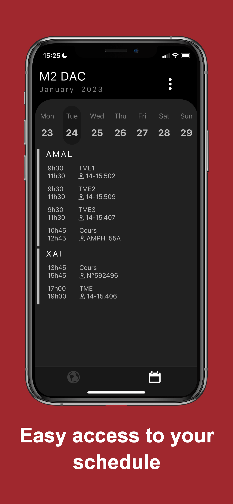
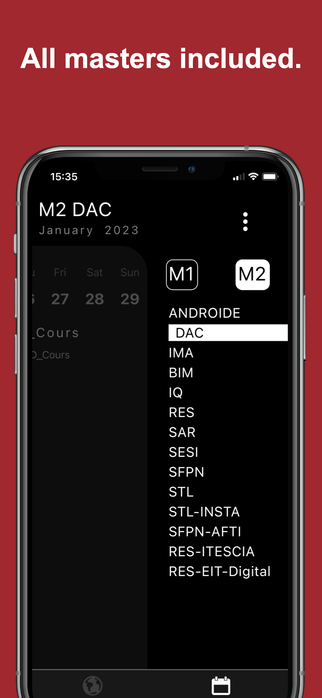
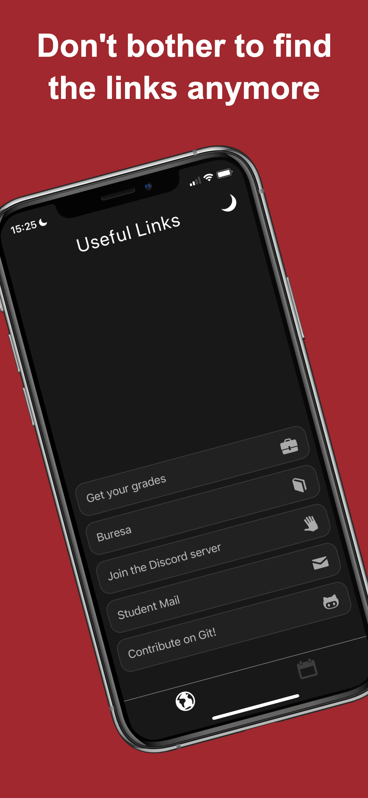

# MySor 

The "Mysor" mobile application is designed for students in the Master of Computer Science at Sorbonne University. It allows users to quickly view their updated timetable with the university's timetable and easily access important links such as grades and their student email.

  
  
  

## Confidentiality Engagement
We understand the importance of privacy to our users and are committed to protecting your personal information.

Our mobile application does not collect any personal data from its users. We do not have access to your personal information, such as your name, email address or phone number. We also do not collect information about your location or your use of the application.

We do not share your information with third parties and we do not use it for advertising or marketing purposes.

If you have any questions about our commitment to privacy, please contact us. We will be happy to answer any questions you may have.

## contact

For any question or enquiry feel free to contact me at hugordet@gmail.com

